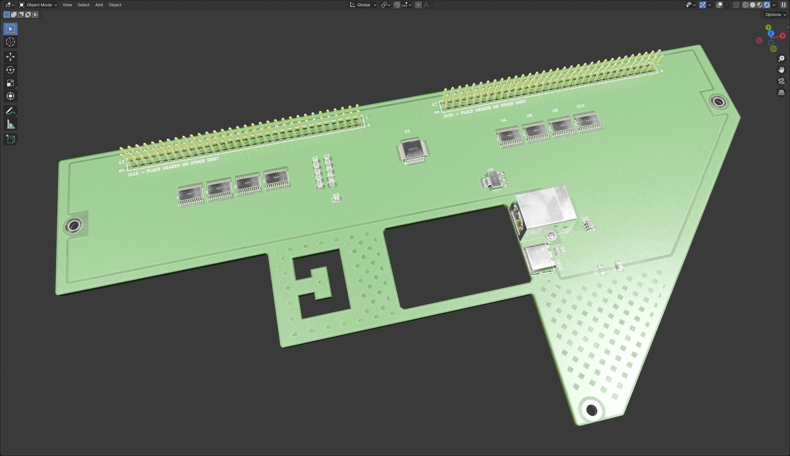

# Siemens Sinumerik840C Maschinensteuertafel Adaptor (WIP! - UNTESTED!)
This interface board is designed to be placed on top of a Siemens Sinumerik840C Maschinensteuertafel in order to be used as user input in LinuxCNC. I reverse engineered a Maschinensteurtafel of Type M (CNC Mill - 6FC5103-0AD03-0AA0) for this project. You can get these pretty cheap on ebay.

The [new generation](https://mall.industry.siemens.com/mall/de/WW/Catalog/Product/6FC5303-0AF22-1AA1) of these Siemens parts are already ProfiNet devices but look very similar the old ones with two 64pin PinHeaders.

## Powering
The board needs no seperate supply voltage and is fully powered by the USB Interface

## USB port(s)
DO NEVER PLUG IN BOTH USB CABLES AT THE SAME TIME! The board is not meant to be used that way!

There are two USB ports on the PCB for convenience reasons. On my desk i primarely use USB-C but for longer runs, like from a computer to a HMI, USB-B cables are the cheaper option. There's also a strain relief, meant to be used with a 5mm cable tie.

## Usage/Software
This interfaceboard is meant to be used in combination with the software [LinuxCNC_ArduinoConnector](https://github.com/AlexmagToast/LinuxCNC_ArduinoConnector). This board does not operate with a Arduino, but with a much more capable [STM32F103C8](https://www.st.com/en/microcontrollers-microprocessors/stm32f103c8.html). The STM32 just emulates a serial port and sends the same signals to the LinuxCNC component like the Arduino would.

## Limitations
Do not use this board for any time critical porpuses!

## Online Preview / BOM
[Online BOM](https://htmlpreview.github.io/?https://raw.githubusercontent.com/PedPEx/Siemens-LinuxCNC-Interface/main/hardware/bom/webviewer-BOM.html)

---
**Note**

The pictures were rendered with the help of Blender and the [pcb2blender](https://github.com/30350n/pcb2blender) plugin and the HTML BOM was created with [InteractiveHtmlBom](https://github.com/openscopeproject/InteractiveHtmlBom).

---