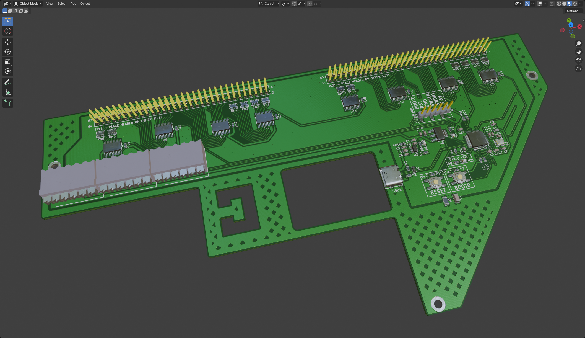

# Siemens Sinumerik840C Maschinensteuertafel Adaptor (WIP! - UNTESTED!)
This interface board is designed to be placed on the backside of an [old type](https://mall.industry.siemens.com/mall/de/de/Catalog/Product/6FC5103-0AD03-0AA0) Siemens Sinumerik840C Maschinensteuertafel in order to be used as user input in LinuxCNC. I reverse engineered a Maschinensteurtafel of Type M (CNC Mill - 6FC5103-0AD03-0AA0) for this project. You can get these pretty cheap on ebay.

The [new generation](https://mall.industry.siemens.com/mall/de/WW/Catalog/Product/6FC5303-0AF22-1AA1) of these Siemens parts are already ProfiNet devices but look very similar the old ones with two 64pin PinHeaders.

## Powering
The board needs no seperate supply voltage and is fully powered by the USB Interface. A power distribution switch deactivates the whole interface in case of an overcurrent (set to 1.0 A).

## USB port
Plug in a USB-C cable and use the provided strain relief with the help of a 5mm cable tie.

## Terminal blocks and general IO
Most of the IO on the three terminal blocks is directly wired into the microcontroller. They can be used for analog inputs or for further expansion in general.

As terminal blocks [Weidmüller 1824460000 - LSF-SMT 3.50/06/90 3.5SN BK TU](https://catalog.weidmueller.com/catalog/Start.do?ObjectID=1824460000) were used - because i had them at hand. But any headers or screw terminals with a 3.5 mm pitch can be used here.

## Usage/Software
This interfaceboard is meant to be used in combination with the software [LinuxCNC_ArduinoConnector](https://github.com/AlexmagToast/LinuxCNC_ArduinoConnector). This board does not operate with a Arduino, but with a much more capable [STM32L151C8](https://www.st.com/en/microcontrollers-microprocessors/stm32l151c8.html). The STM32 just emulates a serial port and sends the same signals to the LinuxCNC component like the Arduino would.

## Limitations
Do not use this board for any time critical porpuses!

## Online Preview / BOM
[Online BOM](https://htmlpreview.github.io/?https://raw.githubusercontent.com/PedPEx/Siemens-LinuxCNC-Interface/master/1_hardware/bom/webviewer-BOM.html)

[3D Preview](https://github.com/PedPEx/Siemens-LinuxCNC-Interface/blob/master/1_hardware/Siemens-Sinumerik840C-Maschinensteuertafel-Adaptor.stl)

## LinuxCNC config
When finished, a example config for LinuxCNC can be found in the [correspondig folder](https://github.com/PedPEx/Siemens-LinuxCNC-Interface/tree/master/2_software_LinuxCNC).

A example of a whole machine fitted with this Interface can be found in my other project [Maho400E-LinuxCNC](https://github.com/PedPEx/Maho400E-LinuxCNC)

## **Note**
The pictures were rendered with the help of Blender and the [pcb2blender](https://github.com/30350n/pcb2blender) plugin and the HTML BOM was created with [InteractiveHtmlBom](https://github.com/openscopeproject/InteractiveHtmlBom).
