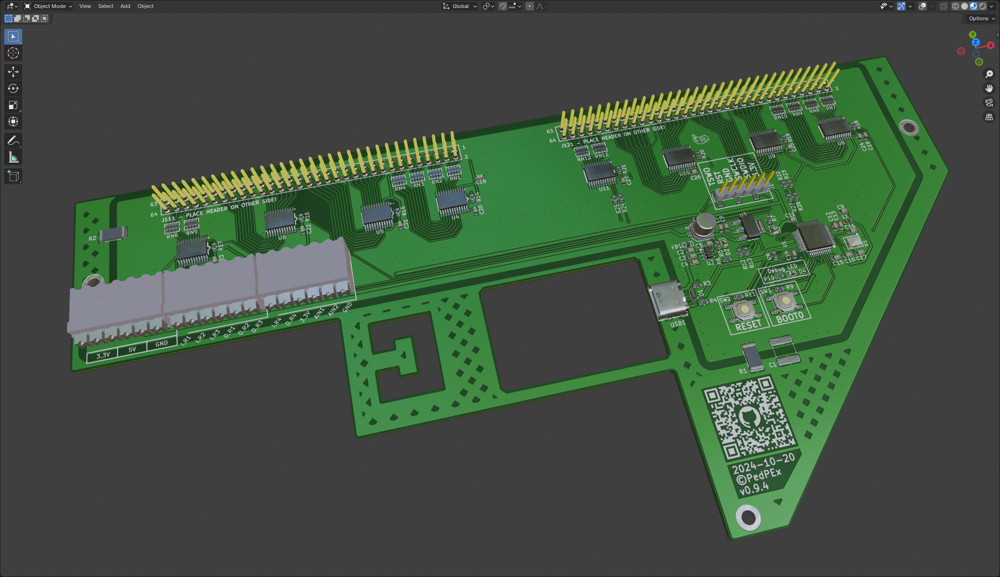

# Siemens Sinumerik840C control panel Interface (WIP! - UNTESTED!)
This interface board is designed to be placed on the backside of an [old type](https://mall.industry.siemens.com/mall/de/de/Catalog/Product/6FC5103-0AD03-0AA0) Siemens Sinumerik840C machine control panel in order to be used as user input in LinuxCNC. I reverse engineered a control panel of type M (CNC-Mill - 6FC5103-0AD03-0AA0) for this project. All the IOs of these control panels are accessible through the two 64pin pinheaders. You can get these machine control panels pretty cheap on ebay.

Interface:

Sinumerik840C Machine Control Panel:

## ToDo
- ✅ finished prototype PCB (v0.9.4)
- 🔲 firmware for STM32L151C8
- 🔲 tested intensively with LinuxCNC
- 🔲 example config for LinuxCNC

## Powering
The board needs no seperate supply voltage and is fully powered by the USB Interface. A power distribution switch deactivates the whole interface in case of an overcurrent (set to 1.0 A).

## USB port
Plug in a USB-C cable and use the provided strain relief with the help of a 5mm cable tie. With this USB connection a virtual serial port is used to send the data to the host. More information in the [software](#usagesoftware) details.

## Terminal blocks and general IO
Most of the IO on the three terminal blocks is directly wired into the microcontroller. They can be used for analog inputs or for further expansion in general.

As terminal blocks [Weidmüller 1824460000 - LSF-SMT 3.50/06/90 3.5SN BK TU](https://catalog.weidmueller.com/catalog/Start.do?ObjectID=1824460000) were used - because i had them at hand. But any headers or screw terminals with a 3.5 mm pitch can be used here.

## Usage/Software
This interface board is meant to be used in combination with the software [LinuxCNC_ArduinoConnector](https://github.com/AlexmagToast/LinuxCNC_ArduinoConnector). It does not operate with an Arduino, but with a much more capable [STM32L151C8](https://www.st.com/en/microcontrollers-microprocessors/stm32l151c8.html). The STM32 just emulates a serial port and sends the same signals to the LinuxCNC component like the Arduino would. The L1 series of STM32 was chosen because of its bootloader

## Limitations
Do not use this board for any time critical porpuses!

## Online Preview / BOM
[Detailed schematics preview](https://kicanvas.org/?github=https%3A%2F%2Fgithub.com%2FPedPEx%2FSiemens-LinuxCNC-Interface%2Ftree%2Fmaster%2F1_hardware) (KiCanvas)

[Online BOM](https://htmlpreview.github.io/?https://raw.githubusercontent.com/PedPEx/Siemens-LinuxCNC-Interface/master/1_hardware/bom/webviewer-BOM.html)

[3D Preview](https://github.com/PedPEx/Siemens-LinuxCNC-Interface/blob/master/1_hardware/Siemens-Sinumerik840C-Maschinensteuertafel-Adaptor.stl)

## LinuxCNC config (TODO)
When finished, an example config for LinuxCNC can be found in the [correspondig folder](https://github.com/PedPEx/Siemens-LinuxCNC-Interface/tree/master/2_software_LinuxCNC).

An example of a whole machine fitted with this Interface can be found in my other project [Maho400E-LinuxCNC](https://github.com/PedPEx/Maho400E-LinuxCNC)

## *Note*
The pictures were rendered with the help of Blender and the [pcb2blender](https://github.com/30350n/pcb2blender) plugin and the HTML BOM was created with [InteractiveHtmlBom](https://github.com/openscopeproject/InteractiveHtmlBom).
